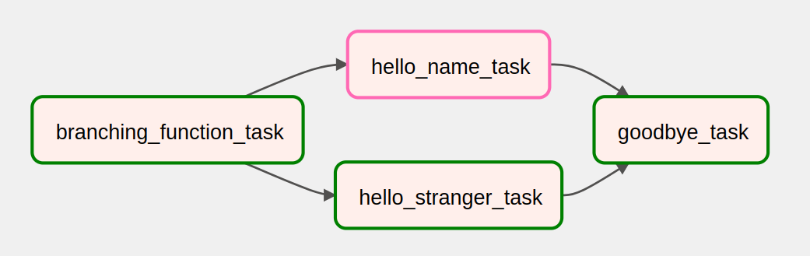

# Tasks no Airflow

No **Airflow**, uma **task** é a menor unidade de trabalho em um fluxo de dados (DAG). Ela define uma etapa específica a ser executada, como chamar uma API, rodar um script Python, ou realizar uma transformação em um banco de dados.

## 1. Relação entre Task, DAG e Executor

- **DAG (Directed Acyclic Graph):**  
  A DAG organiza as tasks em uma estrutura hierárquica e define como elas se conectam e a ordem de execução, mas não executa diretamente as tasks. Cada DAG é composta por uma ou mais tasks.  



- **Executor:**  
  O executor é o componente responsável por gerenciar a execução das tasks. Ele decide como as tasks são agendadas e distribuídas para serem executadas (ex.: `LocalExecutor`, `CeleryExecutor`, ou `KubernetesExecutor`). O tipo de executor determina a escala e o paralelismo da execução das tasks.

## 2. Task Definition, Task Instance e Task Dependencies

### **Task Definition:**  
  A definição de uma task acontece no código Python que cria a DAG. Ela especifica o operador (ex.: `PythonOperator`, `BashOperator`), parâmetros, e outras configurações necessárias para executar a tarefa.

  **Exemplo:**

  ```
  from airflow.operators.python import PythonOperator

  def my_task_function_1():
      print("Task 1!")
  
  def my_task_function_2():
      print("Task 2!")

  my_task_1 = PythonOperator(
      task_id="my_task_1",
      python_callable=my_task_function_1,
      dag=my_dag
  )

  my_task_2 = PythonOperator(
      task_id="my_task_2",
      python_callable=my_task_function_2,
      dag=my_dag
  )
  ```

### **Task Instance:**  
  Quando uma DAG é executada, uma **task instance** é criada para cada execução da task dentro de um intervalo de tempo específico. Ela representa a execução de uma task em um contexto específico.

  **Exemplo:**  
  Se uma DAG está programada para rodar diariamente, e a task `my_task_1` pertence a essa DAG, haverá uma task instance para cada execução diária.

### **Task Dependencies:**  
  As dependências entre tasks são definidas explicitamente no código, indicando a ordem de execução.  

  **Exemplo:**

  ```
  task_1 >> task_2  # task_1 deve ser executada antes de task_2
  ```

## 3. Estados das Tasks

As tasks no Airflow passam por diferentes estados ao longo de sua execução. Os principais estados são:

- **Scheduled:** A task foi programada e está aguardando um executor.  
- **Queued:** A task foi enviada para a fila do executor e está esperando um worker disponível.  
- **Running:** A task está em execução.  
- **Succeeded:** A task foi executada com sucesso.  
- **Failed:** A task falhou durante a execução.  
- **Up for retry:** A task falhou, mas está configurada para ser reexecutada.  
- **Skipped:** A task foi ignorada, geralmente devido a condições de execução que não foram atendidas.  
- **Upstream failed:** A task não foi executada porque uma de suas dependências falhou.  
- **Removed:** A task foi removida da DAG.  
- **Shut down:** A execução da task foi interrompida manualmente ou devido a um desligamento do sistema.  

## Conexão entre Executor e Estados das Tasks

O executor desempenha um papel importante no gerenciamento desses estados. Ele move as tasks entre os estados `queued` e `running` e é responsável por garantir que os recursos necessários estejam disponíveis para executar as tasks.

Essa estrutura modular permite que o Airflow seja escalável, flexível e ideal para automação de workflows complexos.
